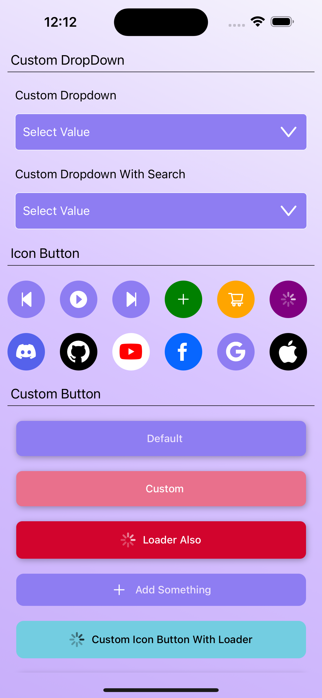
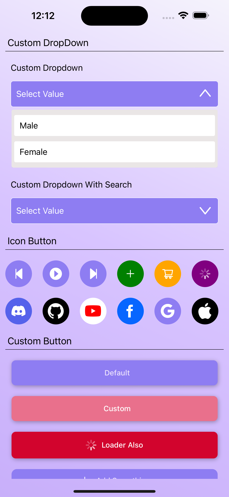
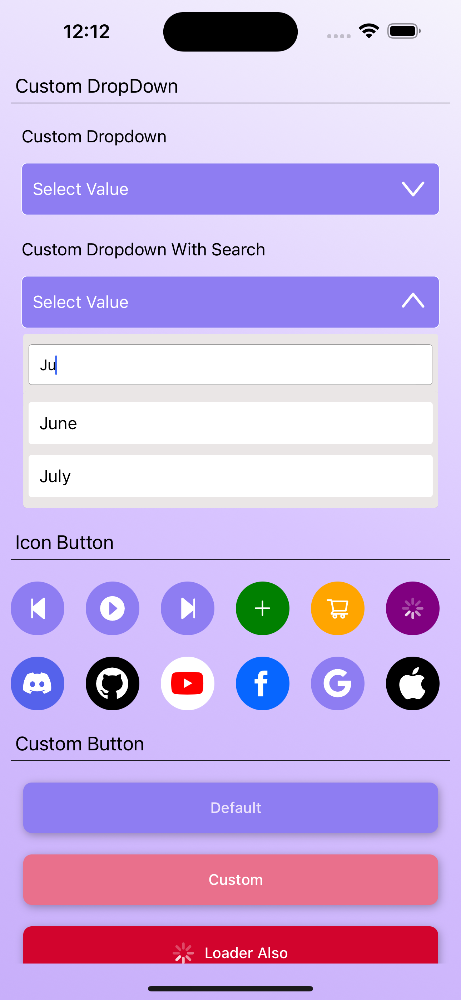
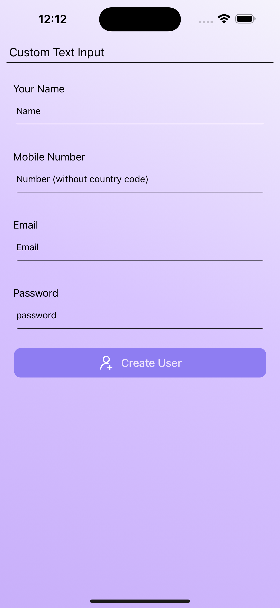

# React Native Boilerplate


Welcome to the React Native Boilerplate repository! This project serves as a solid foundation for your React Native applications, featuring a variety of pre-built, customizable components to streamline your development process.


## Demo Video

Watch a brief demo of the React Native Boilerplate [here](./src/assets/gitAssets/video.mov).


<video width="640" height="360" controls>
  <source src="./src/assets/gitAssets/video.mov" type="video/quicktime">
</video>

## Screenshots

Explore the React Native Boilerplate through these screenshots:






## Demo Video

Watch a brief demo of the React Native Boilerplate [here](./src/assets/gitAssets/video.mov).

## Features

- **Custom Components**: Accelerate your development with pre-built components like Buttons, Dropdowns, and TextInputs.
- **Versatility**: Highly customizable components to suit your app's unique requirements.
- **Efficiency**: Save time on common UI elements, focusing on the core functionality of your app.

## Prerequisites

Before you begin, make sure you have the following:

- [Node.js](https://nodejs.org/)
- [npm](https://www.npmjs.com/)
- [React Native](https://reactnative.dev/)

## Getting Started

1. **Clone the repository:**

    ```bash
    git clone https://github.com/yourusername/react-native-boilerplate.git
    ```

2. **Navigate to the project directory:**

    ```bash
    cd react-native-boilerplate
    ```

3. **Install dependencies:**

    ```bash
    npm install
    ```

4. **Run the application:**

    ```bash
    npx react-native run-android
    ```

    or

    ```bash
    npx react-native run-ios
    ```

## Contributing

Contributions are welcome! Feel free to open issues and pull requests.
